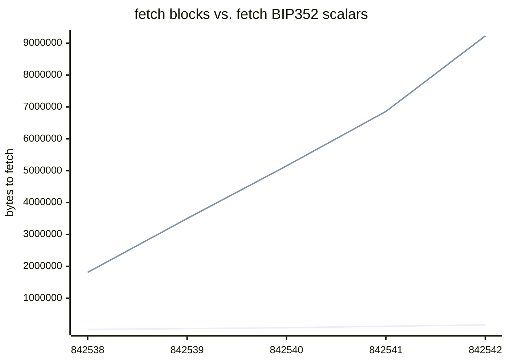

# Silentiumd

Silentium minimizes bandwith requirements of Silent Payment [(BIP352)](https://github.com/bitcoin/bips/pull/1458) wallets. 

## Silent payment "scalar"



BIP352 defines silent payments as key-spend taproot script using a tweaked key.
```
silentpay_tapkey = key + tweak
```

`tweak` is a shared secret computable by the receiver and the sender. As silent payments receiver, you must compute the following for each transactions:

```
tweak = scan_sec_key * input_hash * sum(inputs_pubkeys)
```

It means scanning all taproot transactions in every block making the wallet bandwidth requirements high. 

Silentium connects to a full node and compute the public `scalar` for each transaction containing unspent taproot outputs.

```
scalar = input_hash * sum(inputs_pubkeys)
```

 Thus, a wallet can easily fetch those scalars for each block and compute the corresponding silent payments scripts. Combined with BIP158, the wallet may limit the number of blocks to download.

 ## Run Silentium

 ### Requirements

 * go 1.21
 * bitcoin full node with `txindex=1` and `blockfilterindex=1`

### Build

```
make build
```

### Run

#### Config 

Configure you silentium instance using en variables:

- `SILENTIUM_NETWORK`: The network to connect to. This could be `mainnet`, `testnet`, or `regtest`.

- `SILENTIUM_START_HEIGHT`: The block height at which to start syncing from the blockchain.

- `SILENTIUM_RPC_COOKIE_PATH`: The path to the .cookie file for JSON-RPC authentication.

- `SILENTIUM_RPC_USER`: The username for JSON-RPC authentication. Not required if cookie path set.

- `SILENTIUM_RPC_PASS`: The password for JSON-RPC authentication. Not required if cookie path set.

- `SILENTIUM_RPC_HOST`: The host of the JSON-RPC server. 

- `SILENTIUM_PORT`: The port on which the application should run.

- `SILENTIUM_NO_TLS`: If set to `true`, the application will not use TLS for the gRPC server. Otherwise, it will.

- `SILENTIUM_CERT_FILE`: The path to the TLS certificate file.

- `SILENTIUM_KEY_FILE`: The path to the TLS key file.

- `SILENTIUM_DB_TYPE`: The type of database to use. Can be `badger` or `postgres`.

- `SILENTIUM_BADGER_DATADIR`: The directory where BadgerDB should store its data.

- `SILENTIUM_POSTGRES_DSN`: The Data Source Name (DSN) for connecting to a PostgreSQL database.

then run the binary:

```
./build/silentium-[OS]-[ARCH]
```

## License

<p xmlns:cc="http://creativecommons.org/ns#" xmlns:dct="http://purl.org/dc/terms/"><a property="dct:title" rel="cc:attributionURL" href="https://github.com/louisinger/silentiumd">silentiumd</a> by <a rel="cc:attributionURL dct:creator" property="cc:attributionName" href="https://github.com/louisinger">Louis Singer</a> is licensed under <a href="https://creativecommons.org/licenses/by/4.0/?ref=chooser-v1" target="_blank" rel="license noopener noreferrer" style="display:inline-block;">Creative Commons Attribution 4.0 International</a></p>
