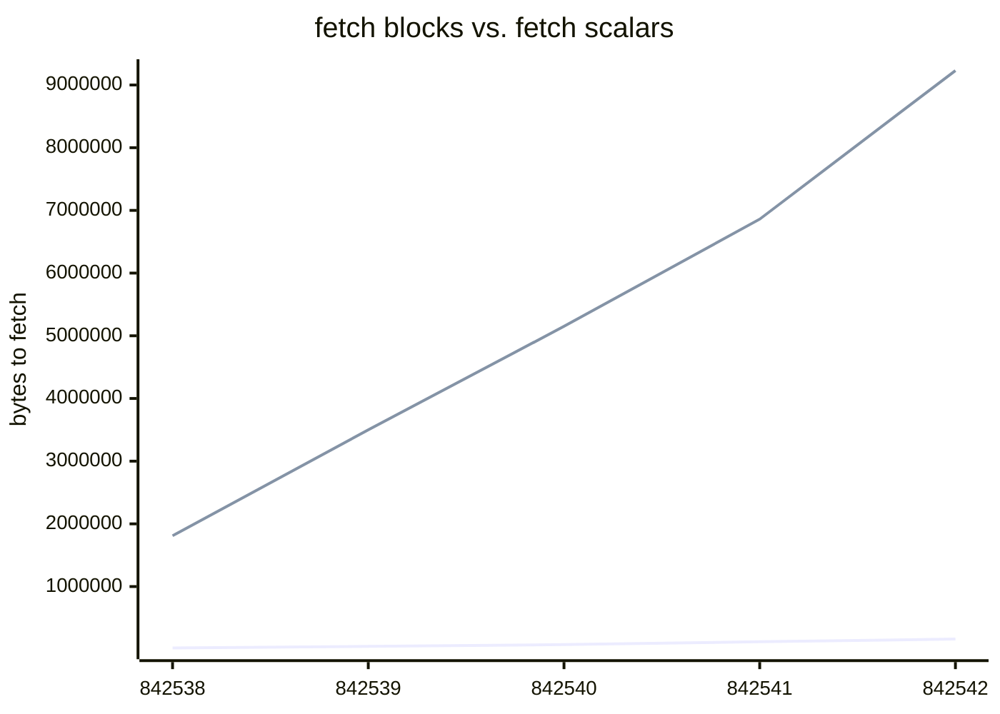

# Silentiumd

Silentium minimizes bandwith requirements of Silent Payment [(BIP352)](https://bips.dev/352/) light wallets (like [silentium app](https://github.com/louisinger/silentium)).

Live on mainnet at [bitcoin.silentium.dev](https://bitcoin.silentium.dev/v1/info) thanks to [Vulpem Ventures](https://vulpem.com/).

## Overview



BIP352 defines silent payments as key-spend taproot script using a tweaked key.
```
silentpay_tapkey = key + tweak
```

`tweak` is a shared secret computable by the receiver and the sender. As silent payments receiver, you must compute the following for each transactions:

```
tweak = scan_sec_key * input_hash * sum(inputs_pubkeys)
```

It means scanning all taproot transactions in every block making the wallet bandwidth requirements high. 

Silentium connects to a full node and compute the public `scalar` for each transaction containing unspent taproot outputs.

```
scalar = input_hash * sum(inputs_pubkeys)
```

 Thus, a wallet can easily fetch those scalars for each block and compute the corresponding silent payments scripts. Combined with BIP158, the wallet may limit the number of blocks to download.

## API

### GetBlockScalars 

`GET /v1/block/{height}/scalars`

*returns the list of scalars for each Silent Payment elligible transaction in the block. Scalars are 33-bytes hex-encoded curve point.*

```json
{
  "scalars": [
    "03c8c2baa6fafa19644c5f7da1ceb6b5e9c24aa079653457190a1201cd4a2c402c",
    "02bc2b880ceb68cf296aea4089022755356b3b59dca8901b6ccb751caa0cdff6c3",
    "...",
    "020c8499f1d29e80357abbd66fa8df1314c2acb3d0d9f5c4110d8a97947864ef2e"
  ]
}
```

### GetBlockFilter

`GET /v1/block/{height}/filter`

*given a block height, returns the BIP158 filter.*

### GetChainTipHeight

`GET /v1/chain/tip`

*returns the latest block height with scalars computed.*

 ## Usage

 ### Requirements

 * go 1.21
 * bitcoin full node with `txindex=1` and `blockfilterindex=1`

### Run

silentium config is set using environment variables. See [config.md](config.md) for more details.

```
$ make build
$ ./build/silentium-[OS]-[ARCH]
```

## Sponsor

Vulpem Ventures is a research-driven company focused on Bitcoin and privacy technologies. They gracefully sponsor the infrastructure of [bitcoin.silentium.dev](https://bitcoin.silentium.dev/v1/chain/tip).

<a href="https://vulpem.com" target="_blank">
    
</a>

### Contributing

Pull requests are welcome. For major changes, please open an issue first to discuss what you would like to change.

#### Buy me a <s>villa</s> coffee

* `sp1qqf2qnptr9rvk6fp7642gjadszkkk84x0rw4m09yvvcq04h2nrcgmyqh2rf5zm33l66vtr9am753jag0zepry5c33j3gx3nw3m380r3pnaglmylyx`

* `bc1pj6zrvrq6s6d8jg5l4lzxe6z0zxv5vxnflthjkev5u4vxutwa9zxqu4f332`


## License

<p xmlns:cc="http://creativecommons.org/ns#" xmlns:dct="http://purl.org/dc/terms/"><a property="dct:title" rel="cc:attributionURL" href="https://github.com/louisinger/silentiumd">silentiumd</a> by <a rel="cc:attributionURL dct:creator" property="cc:attributionName" href="https://github.com/louisinger">Louis Singer</a> is licensed under <a href="https://creativecommons.org/licenses/by/4.0/?ref=chooser-v1" target="_blank" rel="license noopener noreferrer" style="display:inline-block;">Creative Commons Attribution 4.0 International</a></p>
